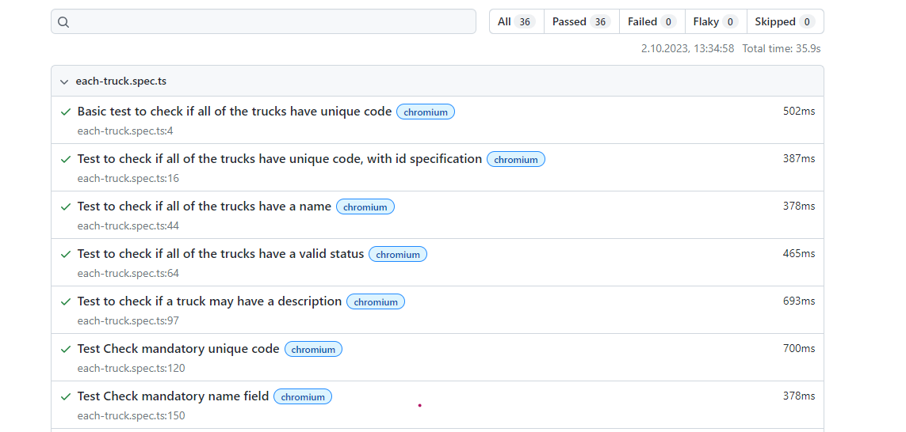

# Truck Management API E2E Testing

This repository contains End-to-End tests for the Truck Management API available at `http://qa-api-mock-3.eu-central-1.elasticbeanstalk.com/`. The tests are written using the Playwright framework.

## Requirements

-   **Truck**:
    -   Must have a unique alphanumeric code.
    -   Must have a name.
    -   Must have a status included in the following set: `Out Of Service`, `Loading`, `To Job`, `At Job`, `Returning`.
    -   The "Out Of Service" status can be set regardless of the current status of the Truck.
    -   Each status can be set if the current status of the Truck is "Out of service".
    -   The remaining statuses can only be changed in the following order: `Loading -> To Job -> At Job -> Returning`. When the Truck has the "Returning" status, it can start "Loading" again.
    -   May have a description.

## GitHub Actions

This project is integrated with GitHub Actions for Continuous Integration (CI). The workflow is triggered in the following scenarios:

- Pushing commits to the main branch.
- Opening, reopening, or editing a pull request.
- Manual trigger.

After the tests are executed, the workflow uploads a test report as an artifact. This allows for easy access and review of the test results.

 

## Manual Triggering of GitHub Actions

If you want to manually trigger the GitHub Actions workflow without making a commit or opening a pull request, you can do so using the following steps:

1. **Navigate to the GitHub Repository**:
   Go to the main page of your GitHub repository.

2. **Go to the "Actions" Tab**:
   Located at the top of the repository, click on the "Actions" tab.

3. **Select the Workflow**:
   On the left sidebar, select the workflow you want to run.

4. **Run Workflow**:
   Above the list of past runs, you'll find a "Run workflow" dropdown. Click on it.

5. **Select the Branch**:
   Using the dropdown, select the branch where you want to run the workflow.

6. **Trigger the Workflow**:
   Click on the "Run workflow" button to start the workflow.

7. **Monitor the Workflow**:
   You can click on the workflow run to monitor the progress, view logs, and see results.

8. **Accessing the Test Report**:
   After the workflow completes, in the specific run summary, under the "Artifacts" section, you can download the test report.

Remember, manually triggering the GitHub Actions workflow will use the latest commit on the branch you select. Ensure you have pushed all your changes to the desired branch before manually triggering the workflow.


## Installation

Ensure you have [Node.js](https://nodejs.org/) installed.

1. Clone the repository:

    ```
    git clone https://github.com/logip87/playwright-api-test.git
    ```

2. Navigate to the project directory:

    ```
     cd playwright-api-trucks
    ```

3. Install the dependencies:

    ```
    npm install
    ```

## Running the Tests

To run all the tests, execute the following command:

    npx playwright test

## Test Suites

1. **truck-OUT_OF_SERVICE.spec.ts**:

    - Tests if the status `OUT_OF_SERVICE` can be updated to any other statuses (`LOADING`, `TO_JOB`, `AT_JOB`, `RETURNING`) and back.

2. **truck-statuses-rotation.spec.ts**:

    - Validates the status rotation order: `Loading -> To Job -> At Job -> Returning -> Loading`.

3. **each-truck.spec.ts**:
    - Ensures that all trucks have unique codes.
    - Checks if all trucks have a name.
    - Verifies if all trucks have a valid status.
    - Validates that a truck may have a description.

## Utility Functions

-   `randomCode()`: Generates a random alphanumeric code.
-   `randomID()`: Generates a random ID.
-   `randomName()`: Generates a random name.
-   `updateStatus()`: Updates the status of a truck.
-   `updateStatusFail()`: Asserts that the status update fails.

## Code Formatting

This project uses [Prettier](https://prettier.io/) for code formatting.
